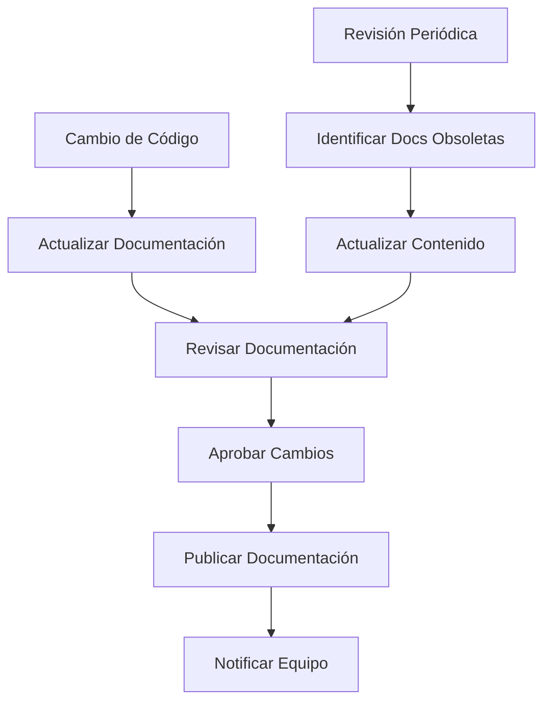

# Estándares de Documentación

Este documento establece estándares universales para la documentación de proyectos de software, aplicables independientemente del lenguaje o framework utilizado.

## 📋 Principios de Documentación

### 1. Audiencia Primero
- **Conocer al lector**: Adaptar el nivel técnico a la audiencia
- **Múltiples perspectivas**: Desarrolladores, usuarios, administradores
- **Progresión lógica**: De lo general a lo específico
- **Contexto relevante**: Información útil para la tarea en cuestión

### 2. Claridad y Concisión
- **Lenguaje simple**: Evitar jerga innecesaria
- **Estructura clara**: Organización lógica y predecible
- **Ejemplos prácticos**: Casos de uso reales
- **Información actualizada**: Mantener consistencia con el código

### 3. Mantenibilidad
- **Documentación viva**: Evoluciona con el código
- **Automatización**: Generar documentación cuando sea posible
- **Responsabilidad compartida**: Todo el equipo mantiene la documentación
- **Revisión regular**: Actualizar periódicamente

## 📚 Tipos de Documentación

### 1. README.md
```markdown
# Nombre del Proyecto

## Descripción
Explicación breve y clara de qué hace el proyecto y por qué es útil.

## Características
- Lista de funcionalidades principales
- Beneficios clave
- Casos de uso principales

## Instalación

### Requisitos
- Node.js >= 14.0.0
- npm >= 6.0.0
- Base de datos PostgreSQL

### Pasos
```bash
# Clonar repositorio
git clone https://github.com/usuario/proyecto.git

# Instalar dependencias
npm install

# Configurar variables de entorno
cp .env.example .env

# Ejecutar migraciones
npm run migrate

# Iniciar aplicación
npm start
```

## Uso

### Uso Básico
```javascript
const api = require('./api');

// Ejemplo simple
const result = await api.getData();
console.log(result);
```

### Configuración
```javascript
const config = {
  apiUrl: 'https://api.ejemplo.com',
  timeout: 5000,
  retries: 3
};
```

## API Reference
Enlace a documentación detallada de API.

## Contribución
Ver [CONTRIBUTING.md](CONTRIBUTING.md) para detalles.

## Licencia
MIT - ver [LICENSE](LICENSE) para detalles.
```

### 2. API Documentation
```markdown
# API Documentation

## Authentication
```http
POST /auth/login
Content-Type: application/json

{
  "email": "user@example.com",
  "password": "password123"
}
```

**Response:**
```json
{
  "token": "eyJhbGciOiJIUzI1NiIsInR5cCI6IkpXVCJ9...",
  "user": {
    "id": 1,
    "email": "user@example.com",
    "name": "John Doe"
  }
}
```

## Endpoints

### GET /api/users
Obtiene lista de usuarios.

**Parameters:**
- `page` (number, optional): Página de resultados (default: 1)
- `limit` (number, optional): Items por página (default: 10)
- `search` (string, optional): Término de búsqueda

**Response:**
```json
{
  "users": [
    {
      "id": 1,
      "name": "John Doe",
      "email": "john@example.com"
    }
  ],
  "pagination": {
    "page": 1,
    "limit": 10,
    "total": 100
  }
}
```

**Error Responses:**
- `400`: Bad Request
- `401`: Unauthorized
- `500`: Internal Server Error
```

### 3. Code Documentation
```javascript
/**
 * Calcula el precio total incluyendo impuestos
 * 
 * @param {number} basePrice - Precio base del producto
 * @param {number} taxRate - Tasa de impuesto (0.0 a 1.0)
 * @param {Object} options - Opciones adicionales
 * @param {number} options.discount - Descuento a aplicar (0.0 a 1.0)
 * @param {boolean} options.includeCurrency - Incluir símbolo de moneda
 * @returns {number|string} Precio total calculado
 * @throws {Error} Si el precio base es negativo
 * @throws {Error} Si la tasa de impuesto es inválida
 * 
 * @example
 * // Uso básico
 * const total = calculateTotal(100, 0.15);
 * console.log(total); // 115
 * 
 * @example
 * // Con opciones
 * const total = calculateTotal(100, 0.15, {
 *   discount: 0.1,
 *   includeCurrency: true
 * });
 * console.log(total); // "$103.50"
 */
function calculateTotal(basePrice, taxRate, options = {}) {
  // Validación de entrada
  if (basePrice < 0) {
    throw new Error('El precio base no puede ser negativo');
  }
  
  if (taxRate < 0 || taxRate > 1) {
    throw new Error('La tasa de impuesto debe estar entre 0.0 y 1.0');
  }
  
  // Cálculo del precio con descuento
  const discountedPrice = basePrice * (1 - (options.discount || 0));
  
  // Cálculo del precio total con impuestos
  const totalPrice = discountedPrice * (1 + taxRate);
  
  // Formateo de salida
  if (options.includeCurrency) {
    return `$${totalPrice.toFixed(2)}`;
  }
  
  return Math.round(totalPrice * 100) / 100;
}
```

## 🏗️ Estructura de Documentación

### 1. Organización de Archivos
```
docs/
├── README.md              # Documentación principal
├── CONTRIBUTING.md        # Guía de contribución
├── CHANGELOG.md          # Historial de cambios
├── LICENSE               # Licencia del proyecto
├── api/                  # Documentación de API
│   ├── authentication.md
│   ├── endpoints.md
│   └── examples.md
├── guides/               # Guías de uso
│   ├── getting-started.md
│   ├── deployment.md
│   └── troubleshooting.md
├── architecture/         # Documentación técnica
│   ├── overview.md
│   ├── database.md
│   └── security.md
└── examples/            # Ejemplos de código
    ├── basic-usage.js
    ├── advanced-config.js
    └── integration-tests.js
```

### 2. Templates de Documentación
```markdown
# Template: Feature Documentation

## Overview
Breve descripción de la funcionalidad.

## Requirements
- Requisitos técnicos
- Dependencias
- Permisos necesarios

## Implementation
### Step 1: Setup
```code
Código de ejemplo
```

### Step 2: Configuration
```code
Código de configuración
```

### Step 3: Usage
```code
Código de uso
```

## Testing
```code
Código de pruebas
```

## Troubleshooting
### Common Issues
- **Issue**: Descripción del problema
- **Solution**: Solución paso a paso

## Related
- Enlaces a documentación relacionada
- Referencias externas
```

## 🔧 Herramientas de Documentación

### 1. Documentación Automática
```javascript
// JSDoc para JavaScript
/**
 * @fileoverview Utilidades para manejo de usuarios
 * @author Equipo de Desarrollo
 * @version 1.0.0
 */

/**
 * @typedef {Object} User
 * @property {number} id - ID único del usuario
 * @property {string} name - Nombre del usuario
 * @property {string} email - Email del usuario
 * @property {Date} createdAt - Fecha de creación
 */

/**
 * @namespace UserUtils
 */
const UserUtils = {
  /**
   * Valida un objeto usuario
   * @memberof UserUtils
   * @param {User} user - Usuario a validar
   * @returns {boolean} true si es válido
   */
  validateUser(user) {
    // Implementación
  }
};
```

### 2. Documentación de API
```yaml
# OpenAPI/Swagger
openapi: 3.0.0
info:
  title: API de Usuario
  version: 1.0.0
  description: API para gestión de usuarios

paths:
  /users:
    get:
      summary: Obtener lista de usuarios
      parameters:
        - name: page
          in: query
          schema:
            type: integer
            default: 1
        - name: limit
          in: query
          schema:
            type: integer
            default: 10
      responses:
        '200':
          description: Lista de usuarios
          content:
            application/json:
              schema:
                type: object
                properties:
                  users:
                    type: array
                    items:
                      $ref: '#/components/schemas/User'

components:
  schemas:
    User:
      type: object
      properties:
        id:
          type: integer
        name:
          type: string
        email:
          type: string
          format: email
```

### 3. Documentación de Base de Datos
```sql
-- Documentación de esquema de base de datos
-- users table: Almacena información básica de usuarios
CREATE TABLE users (
    id SERIAL PRIMARY KEY,              -- ID único autogenerado
    email VARCHAR(255) UNIQUE NOT NULL, -- Email único del usuario
    name VARCHAR(255) NOT NULL,         -- Nombre completo del usuario
    created_at TIMESTAMP DEFAULT NOW(), -- Fecha de creación
    updated_at TIMESTAMP DEFAULT NOW()  -- Última actualización
);

-- Índices para optimizar consultas
CREATE INDEX idx_users_email ON users(email);
CREATE INDEX idx_users_created_at ON users(created_at);

-- Comentarios en la tabla
COMMENT ON TABLE users IS 'Tabla principal de usuarios del sistema';
COMMENT ON COLUMN users.email IS 'Email único para autenticación';
COMMENT ON COLUMN users.name IS 'Nombre completo para mostrar en UI';
```

## 📝 Escritura Efectiva

### 1. Estructura de Contenido
```markdown
# Título Principal (H1)
Introducción breve al tema.

## Sección Principal (H2)
Contenido de la sección.

### Subsección (H3)
Detalles específicos.

#### Detalles Menores (H4)
Información complementaria.

## Ejemplos de Código
```language
código ejemplo
```

## Listas
- Item 1
- Item 2
  - Sub-item 2.1
  - Sub-item 2.2

## Tablas
| Columna 1 | Columna 2 | Columna 3 |
|-----------|-----------|-----------|
| Valor 1   | Valor 2   | Valor 3   |

## Enlaces
- [Texto del enlace](URL)
- [Referencia interna](#sección-principal)
```

### 2. Mejores Prácticas de Escritura
```markdown
# Mejores Prácticas

## ✅ Buenas Prácticas

### Usar Ejemplos Concretos
```javascript
// Bueno: Ejemplo específico y funcional
const user = {
  id: 1,
  name: 'Juan Pérez',
  email: 'juan@ejemplo.com'
};

// Malo: Ejemplo genérico
const user = {
  id: 'id',
  name: 'nombre',
  email: 'email'
};
```

### Explicar el Contexto
```javascript
// Bueno: Explicar cuándo y por qué usar
// Usar este método cuando necesites validar datos de entrada
// antes de procesarlos en el servidor
function validateUserInput(data) {
  // Implementación
}

// Malo: Solo mostrar el código
function validateUserInput(data) {
  // Implementación
}
```

### Incluir Casos de Error
```javascript
// Documentar tanto casos exitosos como errores
try {
  const result = await processData(data);
  console.log('Éxito:', result);
} catch (error) {
  if (error instanceof ValidationError) {
    console.error('Error de validación:', error.message);
  } else {
    console.error('Error inesperado:', error);
  }
}
```

## ❌ Evitar

### Documentación Obsoleta
```javascript
// Malo: Documentación que no coincide con el código
/**
 * Suma dos números
 * @param {number} a - Primer número
 * @param {number} b - Segundo número
 * @returns {number} Suma de a y b
 */
function calculate(a, b, operation) { // ¡Parámetro extra!
  switch (operation) {
    case 'add': return a + b;
    case 'subtract': return a - b;
    default: return 0;
  }
}
```

### Explicaciones Innecesarias
```javascript
// Malo: Explicar lo obvio
// Esta función incrementa la variable i en 1
i++;

// Bueno: Explicar el propósito
// Avanzar al siguiente elemento en la paginación
currentPage++;
```
```

## 📊 Métricas de Documentación

### 1. Indicadores de Calidad
```javascript
// Métricas de documentación
const documentationMetrics = {
  coverage: {
    functions: 85,     // % de funciones documentadas
    classes: 90,       // % de clases documentadas
    modules: 95,       // % de módulos documentados
    apis: 100         // % de APIs documentadas
  },
  
  freshness: {
    lastUpdate: '2024-01-15',
    outdatedDocs: 3,   // Número de docs obsoletas
    avgAge: 30        // Días promedio desde última actualización
  },
  
  usage: {
    pageViews: 1250,   // Vistas mensuales
    userSatisfaction: 4.2, // Rating promedio
    supportTickets: 5  // Tickets relacionados con docs
  }
};
```

### 2. Checklist de Calidad
```
✅ Checklist de Documentación:
□ Título descriptivo
□ Propósito claro
□ Ejemplos funcionantes
□ Casos de error documentados
□ Requisitos especificados
□ Pasos de instalación
□ Información de troubleshooting
□ Enlaces a recursos relacionados
□ Fecha de última actualización
□ Información de contacto
```

## 🔄 Proceso de Mantenimiento

### 1. Workflow de Documentación


### 2. Roles y Responsabilidades
```yaml
documentation_roles:
  developers:
    - Documentar código nuevo
    - Actualizar documentación existente
    - Revisar documentación técnica
    
  technical_writers:
    - Mejorar calidad de escritura
    - Mantener consistencia de estilo
    - Crear guías de usuario
    
  product_managers:
    - Documentar requisitos
    - Mantener documentación de producto
    - Priorizar actualizaciones
    
  qa_engineers:
    - Verificar ejemplos de código
    - Validar procedimientos
    - Reportar inconsistencias
```

### 3. Herramientas de Automatización
```javascript
// Automatización de documentación
const docAutomation = {
  // Generar documentación de API
  generateApiDocs() {
    return swagger.generate('./src/api');
  },
  
  // Validar ejemplos de código
  validateCodeExamples() {
    return codeValidator.checkExamples('./docs/examples');
  },
  
  // Detectar documentación obsoleta
  findOutdatedDocs() {
    return docChecker.findOutdated('./docs', './src');
  },
  
  // Actualizar automáticamente
  autoUpdate() {
    const changes = git.getChanges();
    return docUpdater.updateRelatedDocs(changes);
  }
};
```

## 🎯 Mejores Prácticas por Tipo

### 1. Documentación Técnica
- **Precisión**: Información técnica exacta
- **Completitud**: Cubrir todos los casos de uso
- **Ejemplos**: Código funcional y testeable
- **Versionado**: Documentar cambios entre versiones

### 2. Documentación de Usuario
- **Simplicidad**: Lenguaje accesible
- **Orientación a tareas**: Enfoque en objetivos del usuario
- **Capturas de pantalla**: Ayudas visuales cuando sea útil
- **Troubleshooting**: Soluciones a problemas comunes

### 3. Documentación de API
- **Consistencia**: Formato uniforme
- **Ejemplos de requests/responses**: Casos reales
- **Códigos de error**: Documentación completa
- **Autenticación**: Proceso paso a paso

## 📚 Recursos y Herramientas

### Herramientas de Documentación
- **GitBook**: Documentación colaborativa
- **Confluence**: Wiki empresarial
- **Notion**: Documentación versátil
- **Docusaurus**: Sitios de documentación estáticos
- **Swagger/OpenAPI**: Documentación de API
- **JSDoc**: Documentación de JavaScript
- **Sphinx**: Documentación de Python

### Guías de Estilo
- **Microsoft Writing Style Guide**
- **Google Developer Documentation Style Guide**
- **Write the Docs Style Guide**
- **Atlassian Design System Documentation**

### Plantillas
- **RFC Templates**: Para propuestas técnicas
- **ADR Templates**: Para decisiones de arquitectura
- **Runbook Templates**: Para procedimientos operativos
- **API Reference Templates**: Para documentación de API

---

*La documentación efectiva es una inversión en el futuro del proyecto. Facilita la onboarding, reduce el tiempo de soporte y mejora la experiencia de desarrollo.*